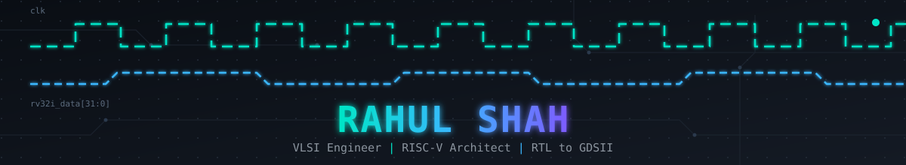

<div align="center">



<br/>


<br/>


[](https://linkedin.com/in/rahul-shah-510a05321)
[](mailto:thanda@opencores.org)
[](https://github.com/rahul-shahtp)
</div>

---

## About Me

```yaml
name: "Rahul Shah"
alias: "Thanda"
education: "B.Tech ECE, USICT GGSIPU Delhi (2024–2028)"
specialization: "VLSI & Hardware Design + AI elective"
focus:
  - "RISC-V Processor Architecture & Design"
  - "ASIC Physical Design (RTL→GDS)"
  - "Digital Design & Verification"
  - "FPGA Prototyping"
  - "Hardware-AI Co-design"
target: "EDA/VLSI Internships (Cadence, Synopsys, Arm)"
philosophy: "A processor that computes 2 + 2 = 5 is just a heater."
```

**Open To:** VLSI Internships · RTL Design · Verification · Physical Design · Hardware-AI Co-design

---

## Tech Stack

<div align="center">

### HDL & Languages


### EDA Toolchain


### PDKs & Platforms


### OS & Tooling


</div>

---

## Featured Projects

<details open>
<summary><b>⚡ Pipelined 32-bit RISC-V RV32IM Processor</b></summary>

<br/>

| Aspect | Details |
|--------|---------|
| **Stack** | Verilog · SystemVerilog · Icarus Verilog · Vivado XSim |
| **Architecture** | 22 modules · 5-stage pipeline · RV32IM (M-ext) |
| **Features** | ALU forwarding (A/B) · Hazard detection · LB/LH/LBU/LHU/SB/SH |
| **Verification** | 16-test regression suite · Load-use stalls · Control flushes |
| **Status** | ✅ All tests pass in Vivado XSim |

Complete RTL implementation of a 5-stage pipelined RISC-V processor with multiply/divide extension and byte/halfword memory ops. Chosen over CSIR NPL Delhi opportunity for stronger EDA internship profile. Foundation for AI accelerator integration.

[Repository](https://github.com/rahul-shahtp/Pipelined-32-bit-RISCV-processor)

</details>

<details>
<summary><b>🚦 Traffic Light Controller — RTL-to-GDS (Clean Tapeout)</b></summary>

<br/>

| Aspect | Details |
|--------|---------|
| **Stack** | Verilog · OpenLane v1.0.2 · Yosys · KLayout · Netgen |
| **Flow** | Full ASIC · SkyWater SKY130A |
| **Verification** | ✅ Zero DRC violations · ✅ Zero LVS violations |
| **Logic** | FSM-based · Sensor-driven highway-road intersection |
| **Status** | First clean tapeout · Documented on LinkedIn |

End-to-end RTL-to-GDS implementation through the open-source ASIC flow. First project to achieve zero DRC/LVS violations — milestone in open-source hardware journey.

[Repository](https://github.com/rahul-shahtp/Traffic-Light-Controller---RTL-to-GDS)

</details>

<details>
<summary><b>🔧 Single-Cycle RV32I Processor</b></summary>

<br/>

| Aspect | Details |
|--------|---------|
| **Stack** | Verilog · Yosys · OpenROAD · Sky130 PDK |
| **Architecture** | 10 modules · 20 instructions · RV32I base ISA |
| **Physical** | ~69K Sky130 cells · 0.82 mm² · DRT-0305 routing challenge |
| **Status** | RTL clean · PnR routing error on power nets (learning) |

32-bit single-cycle RISC-V with full datapath and control unit. Synthesized and physically designed on Sky130A via OpenROAD. The DRT-0305 error on `lpflow_isobufsrc` power nets was a critical lesson in ASIC power grid design.

[Repository](https://github.com/rahul-shahtp/Single-cycle-RISC-V)

</details>

<details>
<summary><b>🧠 AI Accelerator — Systolic Array MAC (Research)</b></summary>

<br/>

| Aspect | Details |
|--------|---------|
| **Architecture** | Memory-mapped systolic array coprocessor on RV32I |
| **Target** | Matrix multiply via parallel MAC operations |
| **Interface** | CPU accesses via memory-mapped addresses |
| **Research** | TPU · Eyeriss · Gemmini · Transformers ("Attention Is All You Need") |
| **Status** | Architecture design phase · Reading list compiled |

Long-term vision: integrate AI inference accelerator with the RV32I pipeline core for edge AI workloads.

</details>

---

## Experience

<div align="center">

| Role | Organization | Period |
|------|-------------|--------|
| **B.Tech ECE (VLSI + AI)** | USICT, GGSIPU Delhi | 2024 – Present |
| **Open Source Contributor** | OpenCores (`shahrahul@opencores.org`) | 2026 – Present |
| **Hardware-AI Research** | Self-directed | 2026 – Present |

</div>

---

## Key Achievements

<div align="center">

| Achievement | Details |
|-------------|---------|
| 🏆 **Clean Tapeout** | TLC RTL→GDS: Zero DRC/LVS on Sky130A |
| 🏆 **RV32IM Pipeline** | 22-module · 5-stage · 16/16 tests passing |
| 🏆 **HDLBits** | FSM, shift registers, PS/2 scancode debugging |

</div>

---


---

</div>

---

## Current Focus

```yaml
learning:
  - "AI Accelerator Architectures (TPU, Eyeriss, Gemmini)"
  - "Advanced ASIC Physical Design"
  - "RISC-V Custom Extensions"
building:
  - "AI Accelerator on RV32I Pipeline"
  - "Systolic Array MAC Coprocessor"
  - "Open Source Hardware Contributions"
exploring:
  - "Hardware-AI Co-design Patterns"
  - "FPGA Prototyping for AI"
  - "ML-Driven EDA Optimization"
open_to:
  - "VLSI Internships (Cadence, Synopsys, Arm)"
  - "RTL Design & Verification"
  - "Physical Design"
  - "Hardware-AI Co-design"
```

---

## Connect

<div align="center">

[](mailto:thanda@opencores.org)
[](https://linkedin.com/in/rahul-shah-510a05321)
[](https://github.com/rahul-shahtp)
[](https://rahulshah.tech)

</div>

---

<div align="center">

*"A processor that computes 2 + 2 = 5 is just a heater."*


</div>
